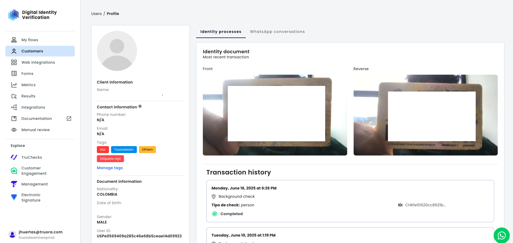
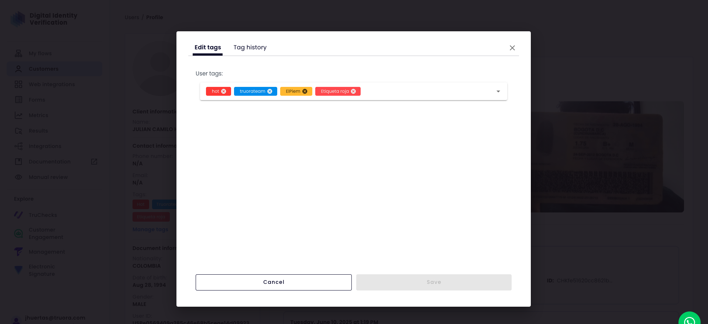

## Asignar etiquetas a un perfil

Asignar etiquetas es la forma principal de segmentar y clasificar usuarios. Esta sección explica cómo ver las etiquetas actuales en un perfil y cómo agregarlas o eliminarlas.

### Ver Etiquetas Existentes en un Perfil

Para entender cómo un usuario está actualmente segmentado, puedes encontrar todas sus etiquetas asignadas directamente en su perfil. Esta información está ubicada centralmente en la vista del perfil del contacto.

Navega al perfil del usuario y localiza la sección **"Información de contacto"**. Dentro de esta sección, verás el campo **"Etiquetas"**.

* **Lista de Etiquetas:** Esta área muestra todas las etiquetas asociadas con el usuario como "píldoras" visuales.
* **Nombre y Color:** El texto en cada píldora corresponde a la propiedad `name` de la etiqueta (ej., "Hot", "Truorateam"), y el color de fondo está determinado por su propiedad `color`.
* **Punto de Partida:** Para modificar estas etiquetas, haz clic en el enlace **"Gestionar etiquetas"** ubicado justo debajo de la lista.

### Agregar y Eliminar Etiquetas

Después de hacer clic en "Gestionar etiquetas", se abrirá una ventana modal. Esta interfaz es el centro de control para modificar las etiquetas de un usuario específico. La vista principal es la pestaña **"Editar etiquetas"**.

* **Asignar una Etiqueta:** Para agregar una etiqueta, haz clic en el campo de entrada **"Etiquetas de usuario"**. Se desplegará una lista buscable de todas las etiquetas disponibles. Selecciona una o más etiquetas para asignarlas al perfil.
* **Eliminar una Etiqueta:** Las etiquetas que un usuario ya tiene aparecen como píldoras. Para eliminar una, simplemente haz clic en el icono **(x)** ubicado a la derecha del nombre de la etiqueta.
* **Guardar Cambios:** Una vez que hayas terminado de editar, es **esencial** hacer clic en el botón **"Guardar"** para aplicar todas las modificaciones. Si cierras la ventana sin guardar, todos los cambios se perderán.
