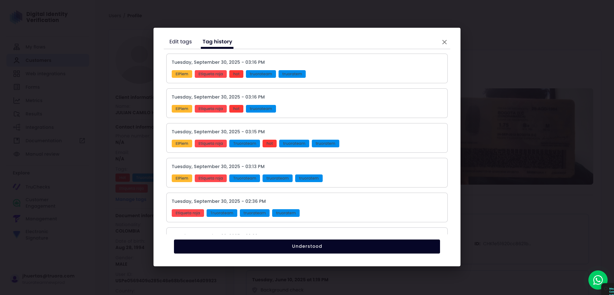
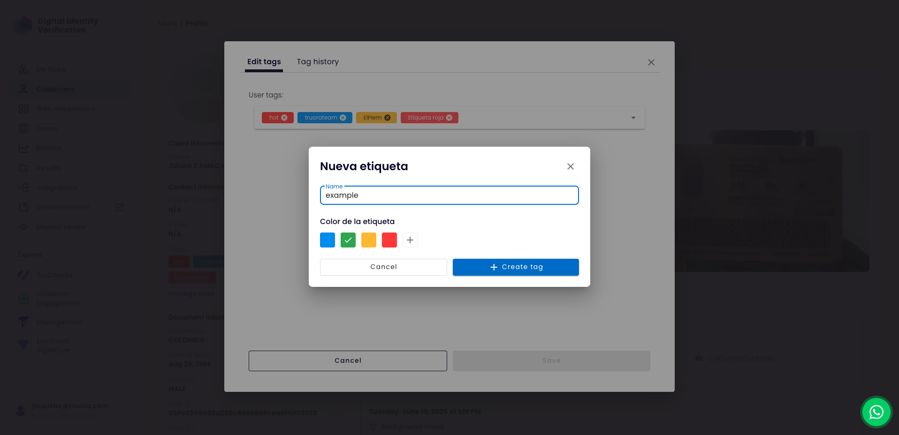

### Acessar o Editor de Tags

Para começar a modificar as tags de um usuário, você deve primeiro abrir o modal de gerenciamento de tags a partir de seu perfil.

1. Na página do perfil do usuário, localize a lista de tags atribuídas sob "Informações de contato".
2. Clique no link **"Gerenciar tags"** diretamente abaixo das pílulas de tags.

Esta ação abrirá uma janela modal que por padrão mostra a aba **"Editar tags"**. Esta tela é o centro de controle onde você pode adicionar, remover e criar novas tags para o usuário.

### Criar uma Nova Tag

Se uma tag que você precisa não existe, você pode criá-la rapidamente a partir do modal "Editar tags" sem sair do perfil do usuário.

1. **Iniciar Criação:** Comece digitando o nome desejado para sua nova tag no campo **"Tags do usuário"**. Conforme você digita, se nenhuma tag existente corresponder ao seu texto, uma opção "Criar tag" aparecerá no menu suspenso.

    

2. **Definir Propriedades:** Clicar em "Criar tag" abre um novo modal. Aqui, você definirá o **Nome** da tag e selecionará uma **Cor da tag** da paleta disponível.

    

3. **Confirmar Criação:** Clique no botão **"+ Criar tag"** para finalizar o processo. A nova tag será criada no sistema e automaticamente atribuída ao perfil do usuário atual. Lembre-se de clicar em **"Salvar"** na janela principal de edição para aplicar a alteração.

### Auditar Alterações com Histórico de Tags

O modal de gerenciamento de tags também fornece um rastro de auditoria completo de todas as alterações feitas nas tags de um usuário ao longo do tempo. Para acessá-lo, clique na aba **"Histórico de tags"**.

* **Registro Cronológico:** O histórico é exibido como uma linha do tempo, com a alteração mais recente no topo.
* **Entradas com Carimbo de Data/Hora:** Cada alteração é registrada com uma data e hora precisas, permitindo que você saiba exatamente quando uma modificação ocorreu.
* **Estado das Tags:** Cada entrada mostra o conjunto completo de tags que o usuário tinha *após* essa alteração específica ser salva, fornecendo um rastro de auditoria completo de como seu perfil evoluiu.
