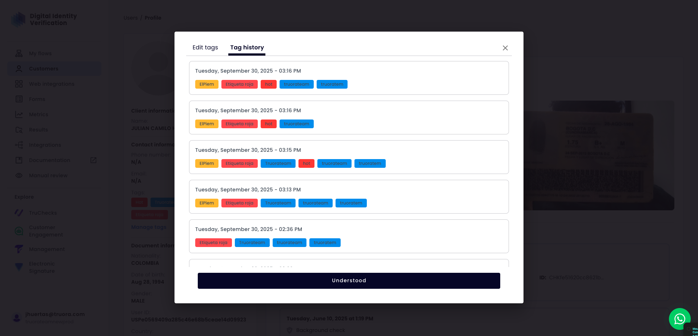

### Accessing the Tag Editor

To begin modifying a user's tags, you must first open the tag management modal from their profile.

1.  On the user profile page, locate the list of assigned tags under "Contact information".
2.  Click the **"Manage tags"** link directly below the tag pills.

This action will open a modal window that defaults to the **"Edit tags"** tab. This screen is the control center where you can add, remove, and create new tags for the user.


### Creating a New Tag

If a tag you need doesn't exist, you can create it on the fly from the "Edit tags" modal without leaving the user's profile.

1.  **Initiate Creation:** Start by typing the desired name for your new tag in the **"User tags"** input field. As you type, if no existing tag matches your text, a "Create tag" option will appear in the dropdown.

    

2.  **Define Properties:** Clicking "Create tag" opens a new modal. Here, you will define the tag's **Name** and select a **Tag color** from the available palette.

    

3.  **Confirm Creation:** Click the **"+ Create tag"** button to finalize the process. The new tag will be created in the system and automatically assigned to the current user's profile. Remember to click **"Save"** in the main edit window to apply the change.

### Auditing Changes with Tag History

The tag management modal also provides a complete audit trail of all changes made to a user's tags over time. To access it, click on the **"Tag history"** tab.



* **Chronological Log:** The history is displayed as a timeline, with the most recent change at the top.
* **Timestamped Entries:** Every change is recorded with a precise date and time, allowing you to know exactly when a modification occurred.
* **State of Tags:** Each entry shows the complete set of tags the user had *after* that specific change was saved, providing a full audit trail of how their profile has evolved.

---

## Managing Tags via API: A Detailed Walkthrough

While the user interface provides a convenient way to manage tags, the API offers powerful automation and integration capabilities. This guide details the developer workflow for programmatically viewing, adding, removing, and creating tags for a user profile using the designated endpoints.

The typical workflow involves three stages: checking the current state, performing an update, and verifying the change.

### Viewing a User's Tag History

Before making any changes, it's best practice to retrieve the current state of a user's tags. This allows you to see which tags are already assigned and provides a baseline for your update.

To do this, you will make a `GET` request to the **`getCustomerTagsHistory`** endpoint. You'll need to provide the user's unique identifier.

**Endpoint:**
* `GET /getCustomerTagsHistory`

**Example Request:**
Imagine you want to see the history for a user with the ID `USR-1138`.

```bash
curl -X GET \
  'https://api.yourdomain.com/v1/users/USR-1138/tags/history' \
  -H 'Authorization: Bearer YOUR_API_KEY'
```

## Managing Global Tags (Create and Update)

While the `updateCustomerTags` endpoint is perfect for assigning tags to a user (and can create them on the fly), you often need to manage the master list of tags available in your system. This involves creating standardized tags *before* they are used or updating their properties (like name or color) globally.

These administrative actions are handled by dedicated endpoints.

### Creating a New Global Tag

Use this endpoint to create a new tag in the system's master list. Once created, this tag will be available in the dropdown menu in the UI and can be assigned to any user via the API. This is the recommended way to pre-define a standardized set of tags.

**Endpoint:**
* `POST /tags`

**Example Request:**
The request body only needs the essential properties of the tag itself: its `name` and `color`.

```json
// POST /v1/tags
{
  "name": "High-Value Customer",
  "color": "#FFD700"
}
```

## API Reference

For detailed API documentation on creating and managing customer tags, see the [Update Customer Tags](/api-reference/endpoint/tags/updateCustomerTags) endpoint in the API playbook.